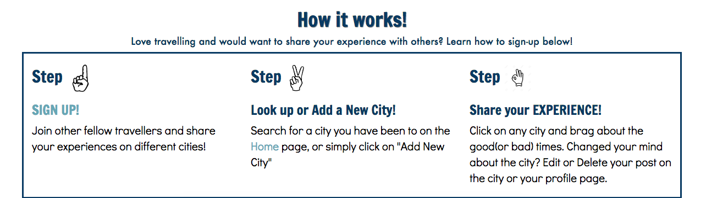

# Vagabond!

*Vagabond is an app for travelers who want to share their experiences of different destinations. Simply sign up and join a community of travelers to connect and discuss cool destinations.*

[Vagabond Link](https://glacial-ridge-30784.herokuapp.com/)

## Team

- Adriana Villagran
- Hector Coronado
- Melissa Carlson
- Franklin Zuniga

## Technologies Used

- Ruby on Rails
- HTML/CSS
- Bootstrap

## Gems Used

* [FontAwesome](https://github.com/bokmann/font-awesome-rails)
* [Figaro](https://github.com/laserlemon/figaro)
* [FFaker](https://github.com/ffaker/ffaker)
* [Bcrypt Ruby](https://github.com/codahale/bcrypt-ruby)
* [Mail](https://github.com/mikel/mail)
* [Hirb](https://github.com/cldwalker/hirb)

## Existing Features

* Sign Up / Log In
* Activate / Deactivate user accounts
* Users can add cities
* Admin account can edit/delete cities
* Search bar for cities
* Users can CRUD posts on city pages and on their own profile page
* Deactivated users are redirected to account activation page
* Catch-all route: any undefined routes are redirected to the homepage
* Dynamic jumbotron: header image is replaced with a city-specific image on each city show page
* Users receive a 'welcome' email when they create an account

## Planned Features

* City name validation with Google Places
* Pagination for posts on city and user show page

## Screenshots

Here is a visual on how it works:

## Test User
###### or SIGN UP!

User | Password
--- | ---
admin | admin
